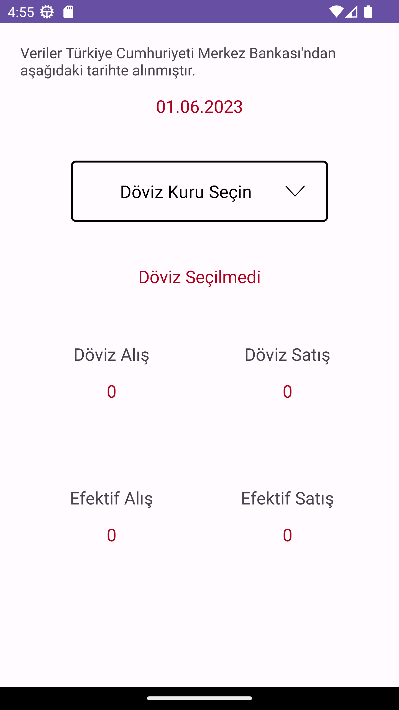
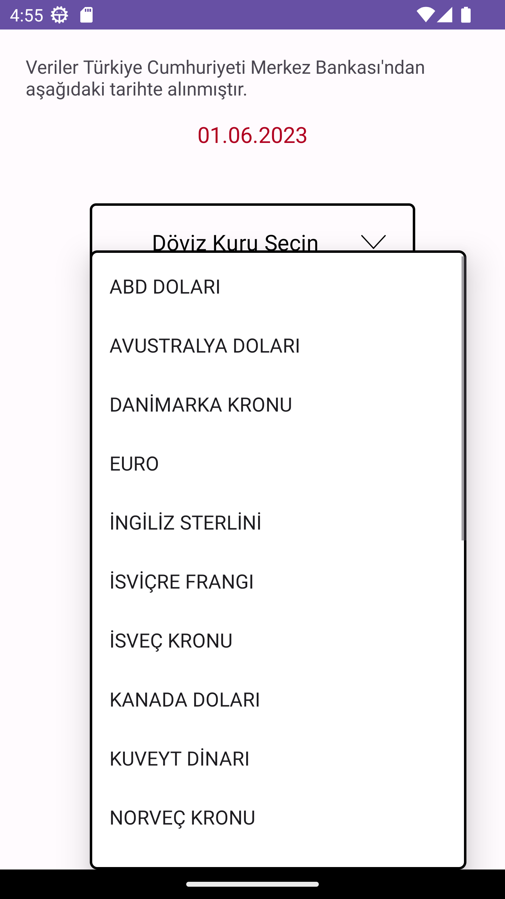
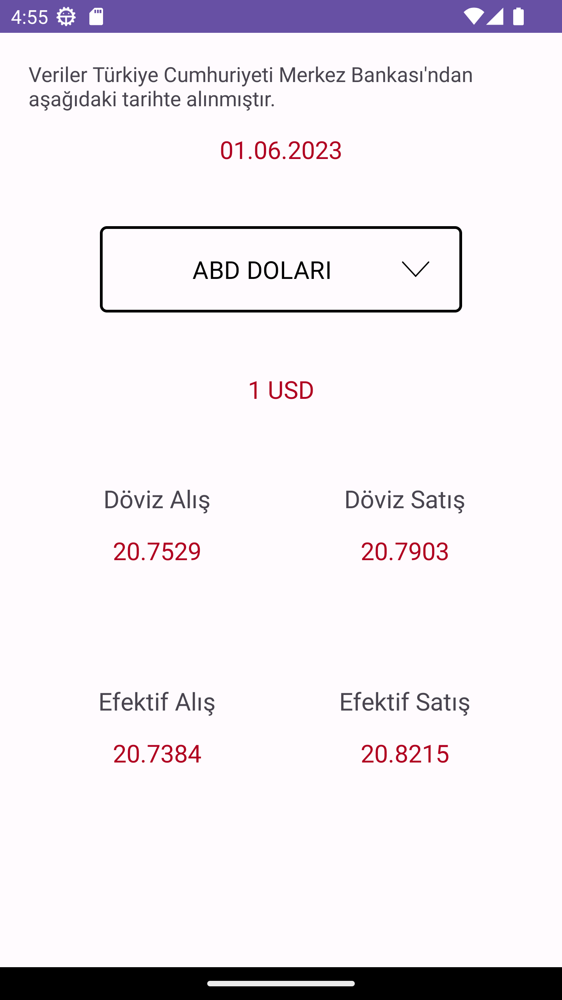

# Exchange-Rate-App
Android app that displays exchange rates received from the Central Bank of the Republic of Turkey using Jsoup

## Used Technologies and Libraries
-Jsoup

## Screenshots
                    
